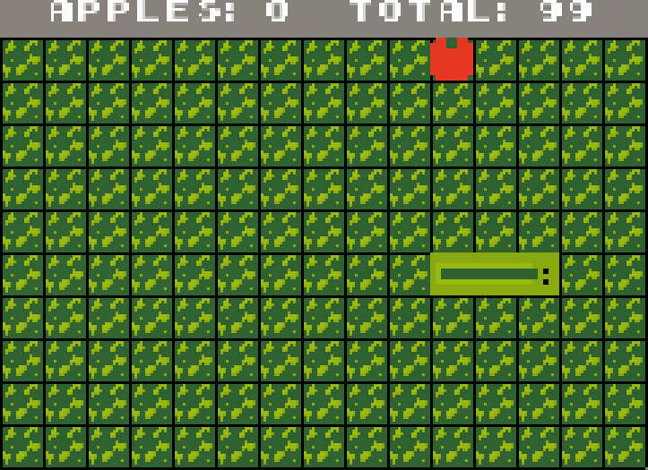
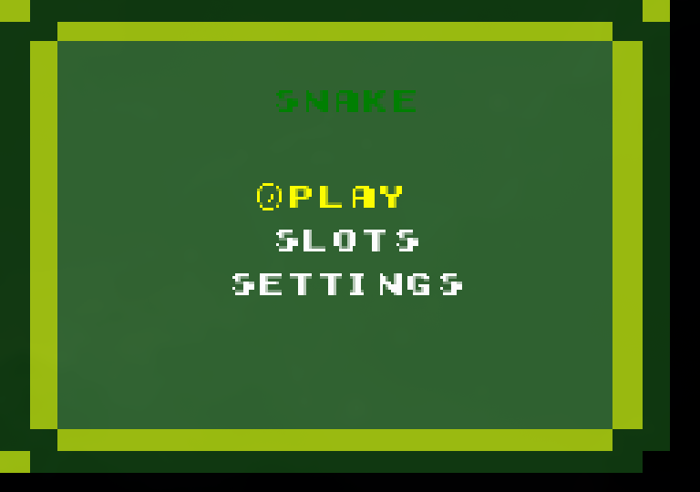
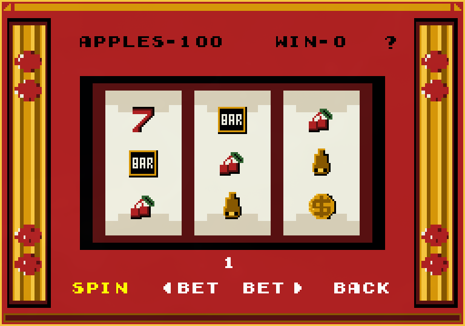
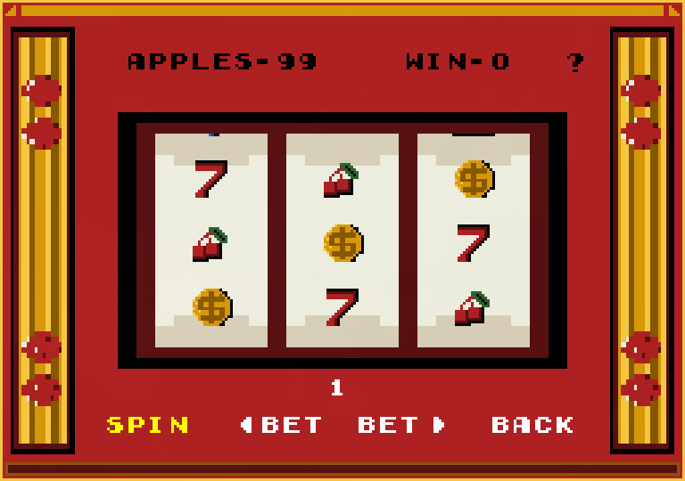
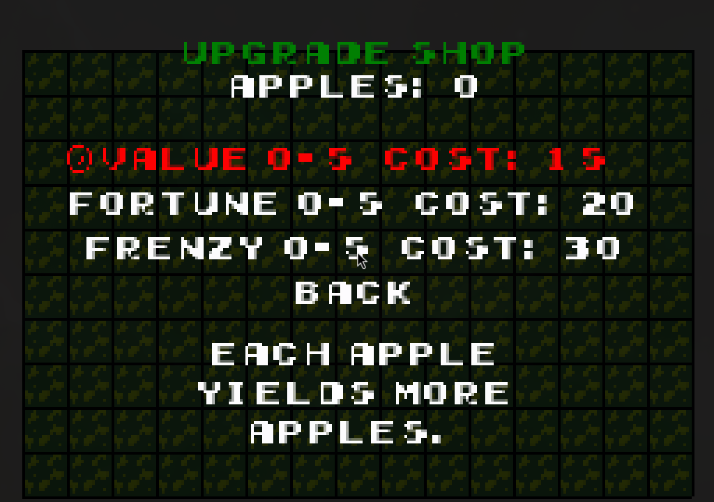

# Snake

A Snake game built in C# with [MonoGame](https://monogame.net/), extended with a slot-machine
minigame, a persistent upgrade economy, and a full audio system. Runs on Windows, Linux, Android,
and iOS from a single shared game core.



---

## Features

- **Classic snake gameplay** on a 15x10 grid, with wall and self-collision detection
- **Apple economy** — apples earned during a run persist between sessions
- **Upgrade shop** with three tiered upgrades that change how the game plays:
  - *Value* — each apple is worth more
  - *Fortune* — chance for a bonus apple to spawn alongside the normal one
  - *Frenzy* — chance for a high-value golden apple that expires on a timer
- **Slots minigame** — a three-reel machine with adjustable bets, a paytable, staggered reel
  stops, and a single payline
- **Audio** — randomized gameplay loop tracks, per-screen music, and sound effects, with
  independent music/SFX volume levels
- **Persistence** — player data saved as JSON to the platform's application-data directory
- **Adaptive layout** — the play area recalculates and letterboxes to fit any window size or
  aspect ratio, including touch controls on mobile targets
- **AI player** — [Laya](https://github.com/NandhaKishorM/laya), a non-autoregressive decision
  model, can play the game and collect apples (`--laya`, see [Playing with Laya](#playing-with-laya))

## Screenshots

| Menu | Slots minigame |
|:---:|:---:|
|  |  |

| Reels in motion | Upgrade shop |
|:---:|:---:|
|  |  |

*In the upgrade shop, the selected row turns red when you can't afford it.*

---

## Architecture

The design goal was a game core with **no platform or rendering dependencies**, so that the same
logic runs unmodified on desktop and mobile. `Snake.Core` contains the entire game; the three
platform projects are thin entry points.

A concrete demonstration: this project was developed in Visual Studio on Windows, then compiled
and run on Arch Linux with **zero source changes** — no conditional compilation, no platform
shims.

### Design patterns

**State pattern** — every screen implements `IGameStateHandler` (`Enter`, `Exit`, `Update`,
`Draw`). `SnakeGame` holds a `Dictionary<GameState, IGameStateHandler>` and forwards each frame to
the active state, which returns the next state to transition to, or `null` to stay put. Adding a
screen means implementing the interface and registering it — no changes to the game loop.

Screens that can be entered from more than one place (Slots, Settings) implement `IOriginAware`,
so the transition passes the originating state and *Back* returns where you came from.

**Component architecture** — cross-cutting concerns sit behind interfaces:

| Interface | Implementation | Responsibility |
|---|---|---|
| `IInputManager` | `InputManager` | Polls keyboard/touch/gamepad once per frame into a unified `InputState` |
| `IGameRenderer` | `GameRenderer` | All `SpriteBatch` drawing, 9-slice and 3-slice composition |
| `IGameStateHandler` | 7 state classes | Per-screen update and draw |
| `IUpgrade` | 3 upgrade classes | Shop entries, iterated generically |
| `IMinigame` | `SlotsMinigame` | Wagering minigames |

**Separation of logic and rendering** — `GameEngine` owns snake movement, collision, food
spawning, and scoring, and contains no drawing code at all. It reports outcomes through an
`UpdateResult` enum and raises events via `GameEvents` for loose coupling (for example, the audio
manager subscribes to `FoodEaten` rather than the engine knowing audio exists).

### Project layout

```
Snake/
├── Snake.Core/          Shared game logic — no platform dependencies
│   ├── Agent/           AgentController, AgentProtocol, IAgentLink (external AI players)
│   ├── Engine/          GameEngine, GameEvents
│   ├── States/          Menu, Playing, Paused, GameOver, Settings, UpgradeShop, Slots
│   ├── Rendering/       IGameRenderer, GameRenderer
│   ├── Input/           IInputManager, InputManager, InputState
│   ├── Audio/           AudioManager
│   ├── Persistence/     SaveManager, PlayerData
│   ├── Upgrades/        IUpgrade + AppleValue, Fortune, Frenzy
│   ├── Minigames/       IMinigame, SlotsMinigame, MinigameResult
│   ├── Configuration/   GameConfig, VisualConfig, LayoutConfig
│   └── Content/         Sprites, fonts, audio (MonoGame content pipeline)
├── Snake.DesktopGL/     Windows / Linux / macOS entry point (+ LayaSidecar)
├── Snake.Android/       Android entry point
└── Snake.iOS/           iOS entry point
agent/                   Python side of the Laya player, simulator and benchmark
```

### Design document

Full design documentation — finite state automata, data flow, UML class and sequence diagrams,
SOLID analysis, and architectural trade-offs — is in
**[docs/sdd-davison-aric.md](docs/sdd-davison-aric.md)**.

---

## Building

Targets **.NET 9** (`net9.0`).

### Windows (Visual Studio)

1. Open `Snake.slnx` (or `Snake/Snake.sln`)
2. Set **Snake.DesktopGL** as the startup project
3. Build and run with `F5`

### Linux

Requires the .NET 9 SDK and **ffmpeg** — MonoGame's content pipeline shells out to `ffmpeg` and
`ffprobe` to build the `.ogg` audio assets, and the content build fails without them.

On Arch:

```bash
sudo pacman -S dotnet-sdk-9.0 ffmpeg
```

On Debian/Ubuntu:

```bash
sudo apt install dotnet-sdk-9.0 ffmpeg
```

Then build and run the desktop project directly:

```bash
dotnet run --project Snake/Snake.DesktopGL -c Release
```

Build the `Snake.DesktopGL` project rather than the solution — the solution also includes the
Android and iOS heads, which need workloads that aren't installed by default (and iOS cannot be
built off macOS).

### Android / iOS

Requires the corresponding .NET workloads:

```bash
dotnet workload install android ios
```

---

## Playing with Laya

Laya can play the desktop build: it steers the snake, and restarts the game after each game over.
The game starts the Python agent as a child process and exchanges one JSON line per snake move with it.

```bash
pip install -r agent/requirements.txt        # Python 3.10+; pulls in torch
LAYA_PYTHON=$(which python) ./play_with_laya.sh
```

The first launch downloads the ~800 MB checkpoint from Hugging Face. The window title shows each
decision (`LAYA: UP 97%`) and the agent logs each game's apples to the terminal. The keyboard
still works: arrow keys override Laya, and Esc saves and quits. The agent doesn't play the slots
or buy upgrades.

Setup, options, how it decides, and benchmark results are in **[agent/README.md](agent/README.md)**.

## Controls

| Key | Action |
|---|---|
| Arrow keys / WASD | Move the snake, navigate menus |
| Enter | Select / confirm |
| Space | Select / confirm, and pause during play |
| P | Pause |
| Esc | Save and exit |

In the slots minigame, Left/Right move between **Spin**, the bet buttons, and **Back**; Enter
activates the selected button; Up opens the paytable. Holding Enter on a bet button repeats it.

On Android and iOS an on-screen D-pad and action buttons are drawn automatically.

---

## About

Built for **WSU CptS 322 (Software Engineering Principles)**. The repository began from a course
template that provided the MonoGame project scaffolding, the platform entry points, and the
localization resources; the game architecture, all gameplay systems, the slots minigame, the
upgrade economy, the audio system, persistence, and asset integration are my own work.
