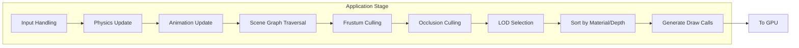
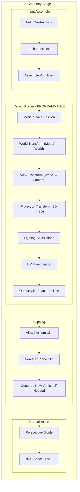
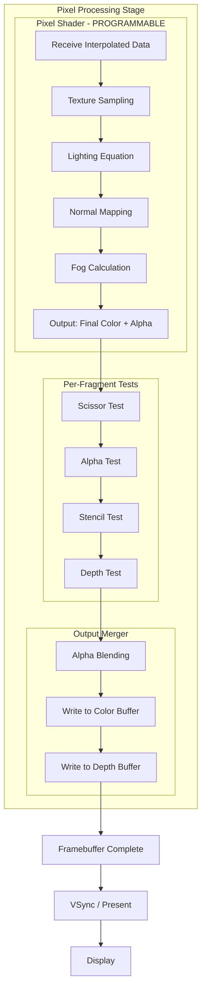
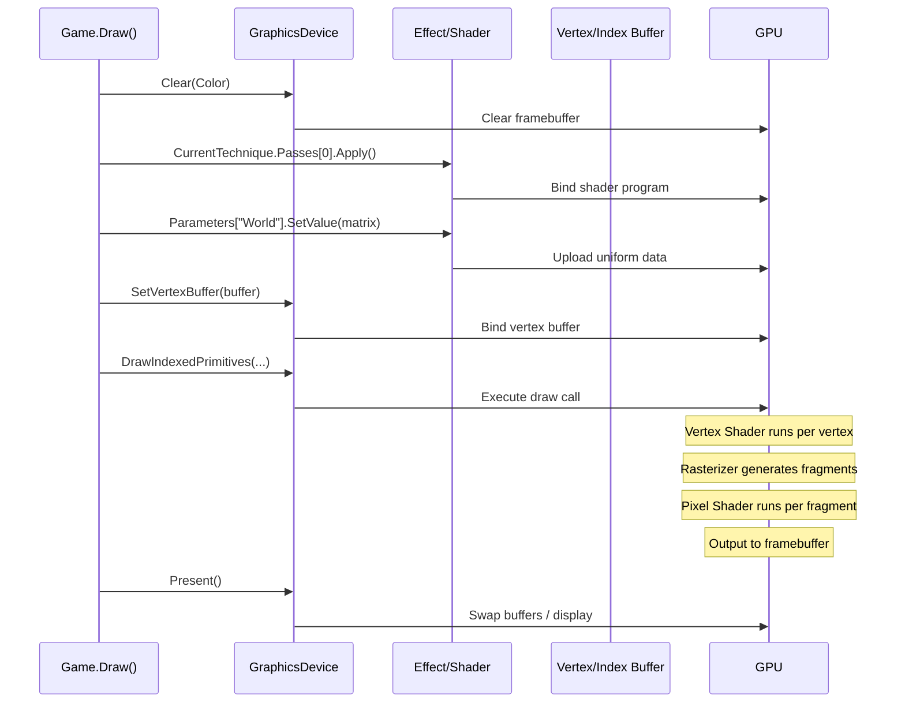

# Graphics Rendering Pipeline - Deep Dive

## The Big Picture

```mermaid
flowchart TB
    subgraph CPU["CPU (Game Logic)"]
        A[Game State Update] --> B[Transform Calculations]
        B --> C[Culling & Sorting]
        C --> D[Build Draw Commands]
    end

    subgraph API["Graphics API Layer (MonoGame/DirectX)"]
        D --> E[Command Buffer]
        E --> F[State Management]
        F --> G[Resource Binding]
    end

    subgraph GPU["GPU Pipeline"]
        subgraph VS["Vertex Processing"]
            H[Input Assembler] --> I[Vertex Shader]
            I --> J[Projection & Clipping]
        end
        
        subgraph RASTER["Rasterization"]
            J --> K[Triangle Setup]
            K --> L[Rasterizer]
            L --> M[Fragment Generation]
        end
        
        subgraph PS["Pixel Processing"]
            M --> N[Pixel Shader]
            N --> O[Texture Sampling]
            O --> P[Alpha/Depth Test]
        end
        
        subgraph OUTPUT["Output"]
            P --> Q[Blending]
            Q --> R[Framebuffer Write]
        end
    end

    G --> H
    R --> S[Display/Present]

    style CPU fill:#2d5016,stroke:#4a8522
    style API fill:#1a3a5c,stroke:#2e6699
    style GPU fill:#5c1a3a,stroke:#992e5c
```

## Detailed Stage-by-Stage Breakdown

### Stage 1: Application Stage (CPU)

### Stage 2: Geometry Processing (GPU)

### Stage 3: Rasterization

```mermaid
flowchart TB
    subgraph RASTER["Rasterization Stage"]
        direction TB
        
        F1[NDC Coordinates] --> F2[Viewport Transform]
        F2 --> F3[Screen Space Coordinates]
        
        F3 --> G1[Triangle Setup]
        G1 --> G2[Edge Equations]
        G2 --> G3[Scan Conversion]
        
        subgraph FRAG["Fragment Generation"]
            G3 --> H1[For Each Pixel in Triangle]
            H1 --> H2[Interpolate Vertex Attributes]
            H2 --> H3["Interpolate: Position, UV, Color, Normal"]
            H3 --> H4[Generate Fragment]
        end
    end

    style FRAG fill:#3d2d5c,stroke:#6644aa
```

### Stage 4: Pixel Processing & Output

---

## N64 vs Modern GPU Comparison

```mermaid
flowchart TB
    subgraph N64["Nintendo 64 - RCP (Reality Coprocessor)"]
        direction TB
        
        subgraph RSP["RSP - Reality Signal Processor"]
            N1[Microcode Execution] --> N2[Vertex Transform]
            N2 --> N3[Lighting per Vertex]
            N3 --> N4[Clipping]
            N4 --> N5[Generate Display List Commands]
        end
        
        subgraph RDP["RDP - Reality Display Processor"]
            N5 --> N6[Rasterization]
            N6 --> N7[Texture Mapping]
            N7 --> N8[Color Combiner]
            N8 --> N9[Blender]
            N9 --> N10[Framebuffer]
        end
    end

    subgraph MODERN["Modern GPU"]
        direction TB
        
        M1[Vertex Shader] --> M2[Hull Shader]
        M2 --> M3[Tessellator]
        M3 --> M4[Domain Shader]
        M4 --> M5[Geometry Shader]
        M5 --> M6[Rasterizer]
        M6 --> M7[Pixel Shader]
        M7 --> M8[Output Merger]
    end

    style N64 fill:#1a472a,stroke:#2d7a47
    style MODERN fill:#2a1a47,stroke:#472d7a
```

---

## MonoGame Draw Call Flow

---

## Render Target Pipeline (Your Retro Setup)

```mermaid
flowchart LR
    subgraph PASS1["Pass 1: Scene Render (320x240)"]
        A[Set Low-Res RT] --> B[Clear]
        B --> C[Draw 3D Scene]
        C --> D[Vertex Lit Shader]
        D --> E[Point Filtered Textures]
        E --> F[Fog Applied]
    end

    subgraph PASS2["Pass 2: Post Process"]
        F --> G[Unbind RT]
        G --> H[Draw RT as Quad]
        H --> I[Upscale Shader]
        I --> J[Optional: Dithering]
        J --> K[Optional: Scanlines]
        K --> L[Optional: Color Grading]
    end

    L --> M[Final Output 1920x1080]

    style PASS1 fill:#2d3a1a,stroke:#4a6622
    style PASS2 fill:#3a1a2d,stroke:#662244
```

---

## Memory Flow During Rendering

```mermaid
flowchart TB
    subgraph VRAM["GPU Memory (VRAM)"]
        V1[Vertex Buffers]
        V2[Index Buffers]
        V3[Textures]
        V4[Constant Buffers/Uniforms]
        V5[Render Targets]
        V6[Depth Buffer]
        V7[Back Buffer]
    end

    subgraph RAM["System Memory (RAM)"]
        R1[Model Data]
        R2[Texture Files]
        R3[Shader Bytecode]
        R4[Game State]
    end

    R1 -->|Upload Once| V1
    R1 -->|Upload Once| V2
    R2 -->|Upload Once| V3
    R3 -->|Compile & Upload| GPU_SHADER[Shader Units]
    R4 -->|Every Frame| V4

    style VRAM fill:#1a3a5c,stroke:#2e6699
    style RAM fill:#5c3a1a,stroke:#996622
```

