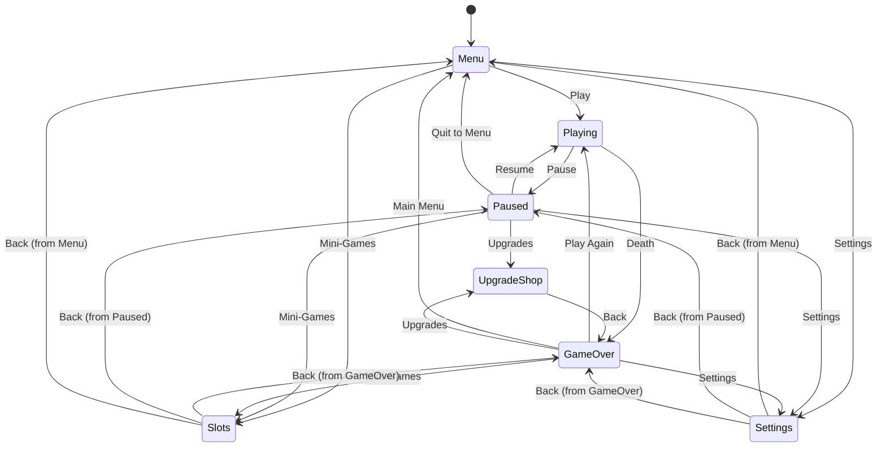
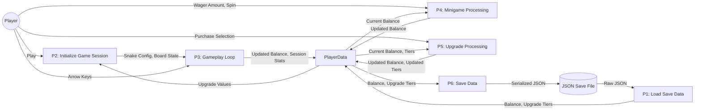
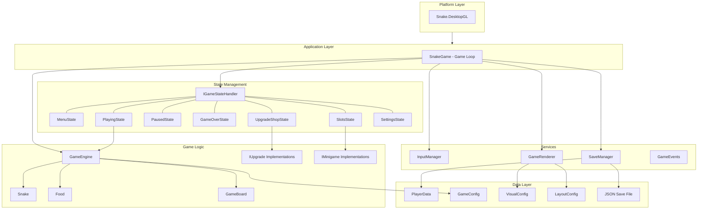
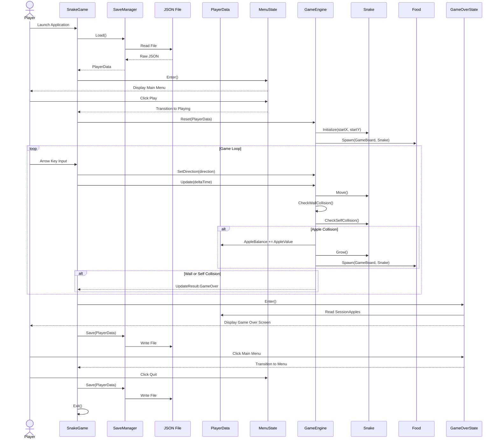
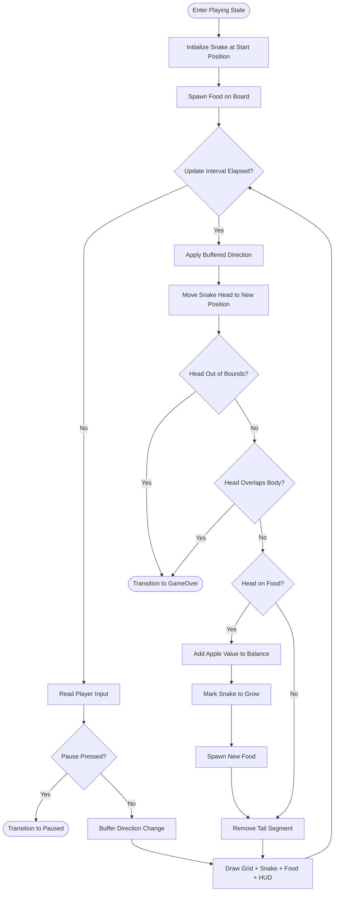

# Snake — System Design Document

**Aric Davison**
**WSU Cpt S 322**

---

## Contents

1. [Introduction](#1-introduction)
2. [Finite State Automata](#2-finite-state-automata)
3. [Data Flow](#3-data-flow)
4. [Architecture](#4-architecture)
5. [Structural Diagrams](#5-structural-diagrams)
6. [Behavioural Diagrams](#6-behavioural-diagrams)

---

## 1 Introduction

### 1.1 Purpose

This document serves as the System Design Document (SDD) for a Snake-based desktop game developed as the final project for CptS 322. It translates the functional and non-functional requirements defined in the Software Requirements Specification (SRS) into a concrete software architecture, detailing the structural and behavioral design decisions that will guide implementation.

The SDD defines the system's finite state automata, data flow, architectural patterns, class structure, and behavioral models. Together, these artifacts establish a shared blueprint for how the game's components interact, how data persists between sessions, and how the codebase is organized to support scalability through adherence to SOLID design principles.

### 1.2 Reference Documents

- MonoGame Framework Documentation — https://docs.monogame.net/
- .NET 9.0 Documentation — https://learn.microsoft.com/en-us/dotnet/core/whats-new/dotnet-9/overview
- C# Language Reference — https://learn.microsoft.com/en-us/dotnet/csharp/
- JSON File Format — https://www.json.org/json-en.html
- System Description (Assignment 1) — Davison, Aric
- Software Requirements Specification (Assignment 2) — Davison, Aric

### 1.3 Abbreviations and Acronyms

- SDD — System Design Document
- SRS — Software Requirements Specification
- FSA — Finite State Automaton
- DFD — Data Flow Diagram
- UML — Unified Modeling Language
- UI — User Interface
- JSON — JavaScript Object Notation
- GPU — Graphics Processing Unit
- SOLID — Single Responsibility, Open/Closed, Liskov Substitution, Interface Segregation, Dependency Inversion

---

## 2 Finite State Automata

The following state diagram models all possible game states and the transitions between them. This diagram has been updated from Assignment 1 to reflect the addition of the Upgrade Shop, Slots mini-game, and Settings screens as distinct states accessible from multiple points in the application.

The system defines seven states: Menu, Playing, Paused, GameOver, UpgradeShop, Slots, and Settings. The Menu state serves as the application's entry point after save data is loaded. From Menu, the player can start a new game (transition to Playing), access Settings, or navigate directly to the Slots mini-game.

During gameplay, the player can pause at any time, which transitions to the Paused state. From Paused, the player can resume, access the Upgrade Shop, Slots, or Settings, or quit to the Main Menu. Purchasing an upgrade from the Paused state silently ends the current run; the player remains in the shop and the Back button returns them to GameOver with their session summary.

The GameOver state acts as a secondary hub. The player can start a new run, return to Menu, access the Upgrade Shop and Slots to spend their accumulated apples, or open Settings. The Slots and Settings states track which state initiated the transition so that the Back button returns the player to the correct origin screen.

---

## 3 Data Flow

The following data flow diagram models the complete data lifecycle of the game, from application launch through gameplay to persistence between sessions. The system uses a single external data store (a local JSON file) and a central in-memory data object (PlayerData) that all processing steps read from and write to.

### 3.1 Processing Descriptions

#### Process 1 — Load Save Data

- **Inputs:** Raw JSON from save file on disk
- **Actions:** SaveManager reads and deserializes the JSON file into a PlayerData object. If no file exists or the file is corrupted, a new PlayerData object is created with default values (zero apple balance, no upgrades, audio enabled).
- **Outputs:** Populated PlayerData object (apple balance, upgrade tiers, audio setting) available in memory

#### Process 2 — Initialize Game Session

- **Inputs:** PlayerData (upgrade tiers), Play command from player
- **Actions:** GameEngine reads upgrade values from PlayerData to configure the snake's speed, apple collection value, and magnet range. The snake is placed at the center of the grid. Food is spawned at a random valid position.
- **Outputs:** Fully initialized game board with configured snake and spawned food

#### Process 3 — Gameplay Loop

- **Inputs:** Arrow key input from player, current snake position, food position, game board boundaries
- **Actions:** Each update tick, the snake moves one cell in the buffered direction. The engine checks for wall collision, self-collision, and food collision. On food collision, the apple balance increments by the configured value, the snake grows, and new food spawns. Session-level statistics (apples earned this run) accumulate.
- **Outputs:** Updated apple balance in PlayerData, updated session statistics, or GameOver signal on death

#### Process 4 — Minigame Processing

- **Inputs:** Wager amount from player, current apple balance from PlayerData
- **Actions:** The system validates the wager against the player's balance and deducts the bet. A random outcome is generated for the slot machine reels. Payouts are calculated based on the result. If the player wins, the payout is added to their balance.
- **Outputs:** Updated apple balance in PlayerData, minigame result (win/loss, payout amount, reel symbols)

#### Process 5 — Upgrade Processing

- **Inputs:** Upgrade selection from player, current apple balance and upgrade tiers from PlayerData
- **Actions:** The system verifies the player can afford the selected upgrade. The cost is deducted from the apple balance and the upgrade's tier is incremented. If the purchase occurs during an active run (via Paused state), the current run is silently ended. The player remains in the shop to continue purchasing.
- **Outputs:** Updated apple balance and upgrade tiers in PlayerData, run termination signal if mid-game

#### Process 6 — Save Data

- **Inputs:** Current PlayerData state (apple balance, all upgrade tiers, audio setting)
- **Actions:** SaveManager serializes the PlayerData object to JSON and writes it to the local save file. This process is triggered on game over, upgrade purchase, slots result, and application quit.
- **Outputs:** Updated JSON save file on disk

---

## 4 Architecture

### 4.1 Overview

The system employs a layered architecture built on top of MonoGame's fixed-timestep game loop. Three primary patterns govern the design: the Game Loop pattern (provided by MonoGame), the State pattern (for screen management), and a Component Architecture (for separating concerns across subsystems). The architecture prioritizes adherence to SOLID principles to ensure the codebase remains scalable as features like additional minigames or upgrade types are introduced.

### 4.2 Architectural Patterns

#### Game Loop Pattern

MonoGame's Game class provides the core loop, calling Update() and Draw() on a fixed timestep. SnakeGame extends this class and acts as the application's entry point and coordinator. It owns all subsystems (input, rendering, persistence, game logic) and delegates per-frame work to the active game state. The loop itself is not customized; MonoGame's default fixed-timestep behavior provides consistent update rates across hardware.

#### State Pattern

All screens in the application implement the IGameStateHandler interface, which defines Enter(), Exit(), Update(), and Draw() methods. SnakeGame maintains a dictionary of state handlers and a reference to the current active state. On each frame, it forwards input and timing data to the current state's Update() method, which returns the next state to transition to (or null to remain). This decouples screen-specific logic from the game loop and makes adding new screens a matter of implementing the interface and registering the state.

For contextual Back navigation (Slots and Settings need to return to whichever screen launched them), the transition method passes the originating state as a parameter, which the target state stores for its Back action.

#### Component Architecture

Cross-cutting concerns are extracted into independent service components. InputManager abstracts keyboard input behind the IInputManager interface, producing a unified InputState per frame. GameRenderer implements IGameRenderer to handle all SpriteBatch rendering. SaveManager encapsulates JSON serialization. GameEvents provides an observer pattern for loose coupling between the engine and UI. PlayerData serves as the shared data object that multiple states read from and write to, owned by SnakeGame and passed by reference. No state owns PlayerData; all states operate on the same instance.

### 4.3 SOLID Principles

**Single Responsibility:** Each class has one reason to change. PlayerData holds persistent state. SaveManager handles file I/O. GameEngine manages gameplay logic. Each state handles its own screen's input and rendering.

**Open/Closed:** The IUpgrade and IMinigame interfaces allow new upgrade types and minigames to be added without modifying existing code. The Upgrade Shop iterates over a list of IUpgrade objects and renders them generically.

**Liskov Substitution:** Any IGameStateHandler can be swapped into the state manager. Any IUpgrade can be rendered in the shop. The system makes no assumptions about concrete types.

**Interface Segregation:** IGameStateHandler is lean (Update, Draw, Enter, Exit). States that need additional behavior (wagering, upgrading) use composition with dedicated interfaces rather than expanding the base interface.

**Dependency Inversion:** SnakeGame depends on IGameStateHandler, IGameRenderer, and IInputManager — not on concrete implementations. The Upgrade Shop depends on IUpgrade, not on SpeedUpgrade directly.

### 4.4 Trade-offs

The state-based architecture introduces a small amount of boilerplate per screen (each state must implement the full interface), but this cost is justified by the clean separation it provides. Adding a new screen requires no changes to existing states or to SnakeGame's core loop.

Using a shared mutable PlayerData object rather than event-driven state synchronization keeps the design simple but means states must be careful not to create race conditions. In practice, only one state is active at a time, so this is safe for a single-threaded game loop.

The architecture is intentionally not MVC. MonoGame's tight coupling between Update and Draw cycles makes a formal Controller layer unnecessary overhead for a project of this scope. Each state combines controller and view responsibilities, while the model (PlayerData, game logic) remains separate.

### 4.5 Component Diagram

---

## 5 Structural Diagrams

### 5.1 UML Class Diagram

The class diagram below shows the complete target design for the system. It captures all interfaces, concrete classes, their fields and methods, and the relationships between them. The diagram is organized into five groups: interfaces that define contracts (IGameStateHandler, IGameRenderer, IInputManager, IUpgrade, IMinigame), the core game classes (SnakeGame, GameEngine, Snake, Food, GameBoard), state implementations (MenuState, PlayingState, PausedState, GameOverState, UpgradeShopState, SlotsState, SettingsState), the data and persistence layer (PlayerData, SaveManager), and domain-specific implementations (SpeedUpgrade, AppleValueUpgrade, AppleMagnetUpgrade, SlotsMinigame).

Key relationships include: SnakeGame owns and coordinates all subsystems through their interfaces. GameEngine owns the Snake, Food, and GameBoard entities and is delegated to by PlayingState. All state implementations realize IGameStateHandler. The upgrade classes realize IUpgrade, and the SlotsMinigame realizes IMinigame. UpgradeShopState and SlotsState both hold references to PlayerData for reading and writing the apple balance and upgrade tiers. SaveManager serializes PlayerData to and from the JSON save file.

```mermaid
classDiagram
    direction TB

    class IGameStateHandler {
        <<interface>>
        +GameState StateType
        +Enter()
        +Exit()
        +Update(GameTime, InputState) GameState
        +Draw(IGameRenderer)
    }

    class IGameRenderer {
        <<interface>>
        +LoadContent(GraphicsDevice, ContentManager)
        +BeginFrame()
        +EndFrame()
        +DrawGrid(int, int)
        +DrawSnake(Snake)
        +DrawFood(Food)
        +DrawApples(int sessionApples, int totalBalance)
        +DrawOverlay(Color)
        +DrawCenteredText(string, Color, float)
        +HasFont bool
    }

    class IInputManager {
        <<interface>>
        +Update()
        +CurrentState InputState
    }

    class IUpgrade {
        <<interface>>
        +Name string
        +Description string
        +CurrentTier int
        +MaxTier int
        +GetCost(int tier) int
        +Apply(PlayerData)
    }

    class IMinigame {
        <<interface>>
        +Name string
        +MinimumWager int
        +PlaceBet(int amount, PlayerData) bool
        +Play() MinigameResult
        +ResolvePayout(PlayerData)
    }

    class SnakeGame {
        -GraphicsDeviceManager m_graphics
        -GameConfig m_gameConfig
        -VisualConfig m_visualConfig
        -LayoutConfig m_layoutConfig
        -IInputManager m_inputManager
        -IGameRenderer m_renderer
        -PlayerData m_playerData
        -SaveManager m_saveManager
        -IGameStateHandler m_currentState
        +Initialize()
        +LoadContent()
        +Update(GameTime)
        +Draw(GameTime)
        -TransitionToState(GameState, GameState)
    }

    class GameEngine {
        -GameConfig m_config
        -GameBoard m_board
        -GameEvents m_events
        -Snake m_snake
        -Food m_food
        -int m_sessionApples
        -double m_timeSinceLastUpdate
        +Snake Snake
        +Food Food
        +SessionApples int
        +Events GameEvents
        +Reset(PlayerData)
        +SetDirection(Direction)
        +Update(double) UpdateResult
        -CheckWallCollision() bool
    }

    class Snake {
        -List m_body
        -Direction m_direction
        -Direction m_nextDirection
        -bool m_shouldGrow
        +Head Point
        +Body IEnumerable
        +AllSegments IEnumerable
        +CurrentDirection Direction
        +SetDirection(Direction)
        +Move()
        +Grow()
        +CheckSelfCollision() bool
    }

    class Food {
        -Point m_position
        -Random m_random
        +Position Point
        +Spawn(GameBoard, Snake)
    }

    class GameBoard {
        -GameConfig m_config
        +GridWidth int
        +GridHeight int
    }

    class MenuState {
        +StateType GameState
        +Update(GameTime, InputState) GameState
        +Draw(IGameRenderer)
    }

    class PlayingState {
        -GameEngine m_engine
        +StateType GameState
        +Enter()
        +Update(GameTime, InputState) GameState
        +Draw(IGameRenderer)
    }

    class PausedState {
        +StateType GameState
        +Update(GameTime, InputState) GameState
        +Draw(IGameRenderer)
    }

    class GameOverState {
        -int m_sessionApples
        +StateType GameState
        +Enter()
        +Update(GameTime, InputState) GameState
        +Draw(IGameRenderer)
    }

    class UpgradeShopState {
        -List m_upgrades
        -PlayerData m_playerData
        +StateType GameState
        +Update(GameTime, InputState) GameState
        +Draw(IGameRenderer)
    }

    class SlotsState {
        -SlotsMinigame m_slots
        -PlayerData m_playerData
        +StateType GameState
        +Update(GameTime, InputState) GameState
        +Draw(IGameRenderer)
    }

    class SettingsState {
        +StateType GameState
        +Update(GameTime, InputState) GameState
        +Draw(IGameRenderer)
    }

    class PlayerData {
        +int AppleBalance
        +Dictionary UpgradeTiers
        +int HighScore
        +bool AudioEnabled
        +GetUpgradeTier(string upgradeId) int
        +SetUpgradeTier(string upgradeId, int tier)
    }

    class SaveManager {
        -string m_filePath
        +Save(PlayerData)
        +Load() PlayerData
        -CreateDefault() PlayerData
    }

    class SpeedUpgrade {
        +Name string
        +MaxTier int
        +GetCost(int) int
        +Apply(PlayerData)
    }

    class AppleValueUpgrade {
        +Name string
        +MaxTier int
        +GetCost(int) int
        +Apply(PlayerData)
    }

    class AppleMagnetUpgrade {
        +Name string
        +MaxTier int
        +GetCost(int) int
        +Apply(PlayerData)
    }

    class SlotsMinigame {
        -Random m_random
        +MinimumWager int
        +PlaceBet(int, PlayerData) bool
        +Play() MinigameResult
        +ResolvePayout(PlayerData)
    }

    class MinigameResult {
        +bool Won
        +int Payout
        +string[] ReelResults
    }

    class GameEvents {
        +event ScoreChanged
        +event GameOver
        +event FoodEaten
        +event StateChanged
    }

    class InputState {
        +Direction RequestedDirection
        +bool PausePressed
        +bool ActionPressed
        +bool AnyInputPressed
        +bool ExitRequested
        +Reset()
    }

    class GameConfig {
        +double UpdateInterval
        +int ApplesPerFood
        +int GridWidth
        +int GridHeight
        +int InitialSnakeLength
    }

    SnakeGame --> IGameStateHandler : manages
    SnakeGame --> IGameRenderer : owns
    SnakeGame --> IInputManager : owns
    SnakeGame --> PlayerData : owns
    SnakeGame --> SaveManager : owns
    SnakeGame --> GameEngine : owns

    GameEngine --> Snake : owns
    GameEngine --> Food : owns
    GameEngine --> GameBoard : uses
    GameEngine --> GameEvents : owns
    GameEngine --> GameConfig : reads

    MenuState ..|> IGameStateHandler
    PlayingState ..|> IGameStateHandler
    PausedState ..|> IGameStateHandler
    GameOverState ..|> IGameStateHandler
    UpgradeShopState ..|> IGameStateHandler
    SlotsState ..|> IGameStateHandler
    SettingsState ..|> IGameStateHandler

    GameRenderer ..|> IGameRenderer
    InputManager ..|> IInputManager

    SpeedUpgrade ..|> IUpgrade
    AppleValueUpgrade ..|> IUpgrade
    AppleMagnetUpgrade ..|> IUpgrade

    SlotsMinigame ..|> IMinigame

    UpgradeShopState --> IUpgrade : displays
    UpgradeShopState --> PlayerData : modifies
    SlotsState --> SlotsMinigame : uses
    SlotsState --> PlayerData : modifies
    PlayingState --> GameEngine : delegates
    GameOverState --> PlayerData : reads

    SaveManager --> PlayerData : serializes
```

---

## 6 Behavioural Diagrams

### 6.1 UML Sequence Diagram

#### 6.1.1 Game Play Start and End

The sequence diagram below captures the full application lifecycle from launch to termination. It traces the event sequence through six phases: application startup and save data loading, main menu display, game initialization, the gameplay loop (input handling, movement, collision detection, apple collection), game over handling with session summary, and application exit with final save.

The diagram shows how SnakeGame coordinates between subsystems. On launch, SaveManager reads the JSON file and produces a PlayerData object. When the player starts a game, GameEngine is reset with the current PlayerData to configure the snake based on upgrade tiers. During gameplay, the loop repeats each tick: input is read, direction is buffered, the snake moves, and collisions are checked in order (walls, self, food). On death, the GameOver state reads session statistics from the engine, the save is triggered, and the player can navigate to a new game, the menu, or the shop. On quit, a final save ensures all progress is persisted.

### 6.2 Game Play Flow Chart

The flowchart below provides a focused view of the Playing state's frame-by-frame logic. This is the implementation blueprint for how the game processes each update tick within an active Snake session.

On entering the Playing state, the snake is initialized at the center of the grid and food is spawned. The main loop checks whether the update interval has elapsed. If not, the system reads player input, checks for a pause request, buffers any direction change, renders the current frame, and waits for the next tick. When the interval elapses, the buffered direction is applied, the snake head moves to the new position, and collision detection runs in sequence: first boundary collision (is the head out of bounds?), then self-collision (does the head overlap the body?). If either collision is true, the system transitions to GameOver. If no collision occurred, the system checks for food collision. On a food hit, the apple value is added to the balance, the snake is marked to grow (skipping tail removal on this tick), and new food spawns. Finally, the tail segment is removed (unless growing), the frame is rendered, and the loop repeats.

